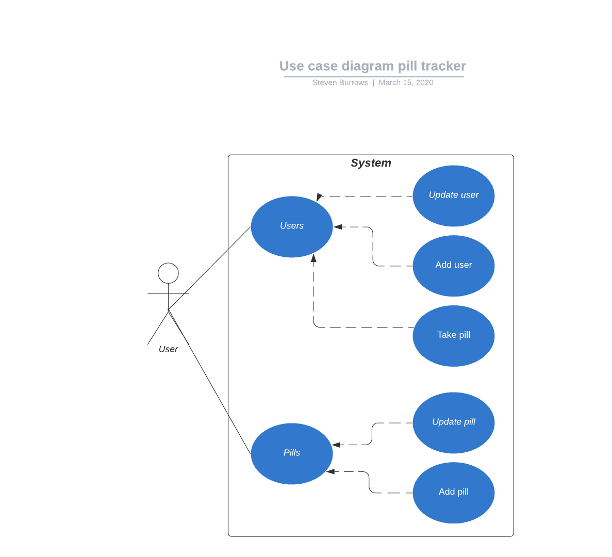
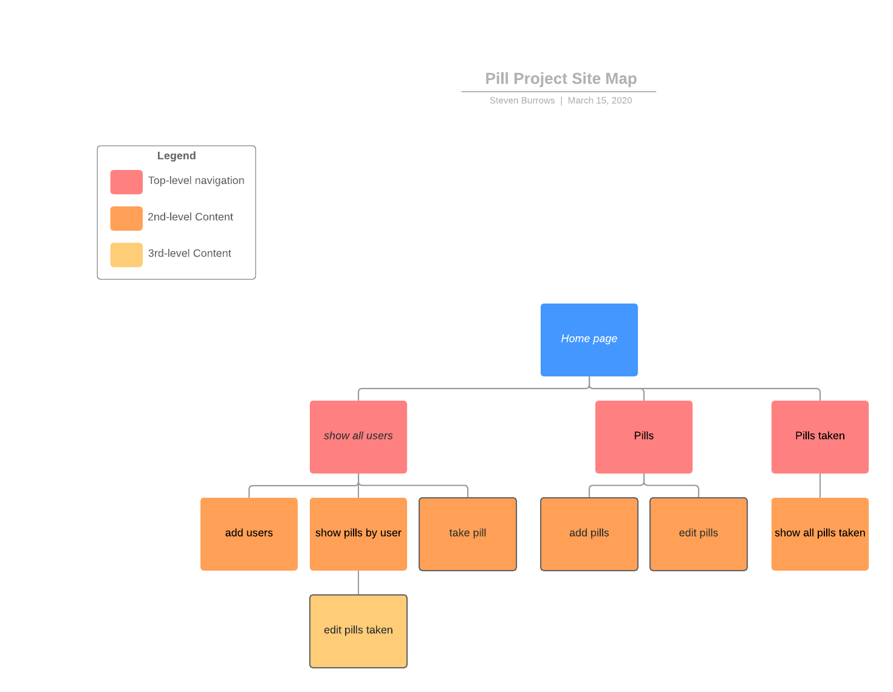

# Ruby_sintra_project

## Pill reminder

A client has asked for an app where they can mark that the have taken a pill and the when it was taken.  They often forget if or when they take their pills due to the number they take and an app to track it would help them manage this more easily while also helping their health.

### MVP

The app should allow the user to create and edit pills.  
The app should be able to create and edit users
Pills should have a name, type and strength
The user should have a name and age
When you takes a pill the time should be recorded for that user and pill
The app should show the pills available and also able to view what pills you have taken for a given user.

### Possible extension

Pills should have a maximum amount per day and this is counted down when a pill is taken
Deactivate a pill that is no longer used so can’t be selected.
Show pills taken for a a given day
Create another table for pill strength where it has two variables, strngth number and strength units i.e. milligrams and micrograms

### setup

To run this app you need Ruby and PostgreSQL, along with the following gems
* PG
* Sinatra
* sinatra-contrib 

once all the above have been installed you need to create a database called pill_tracker and assumes no authentication is needed

### Documentation

As part of the project I had to plan the app and part of that was ux and user case diagrams.  Below are some of these diagrams

#### Use case Diagram

#### Site map

